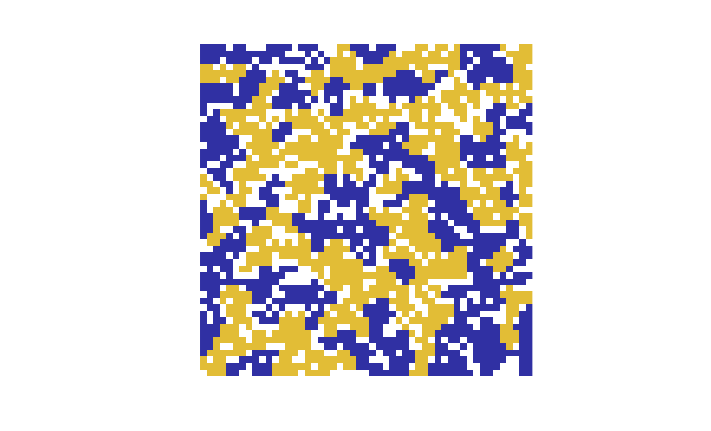
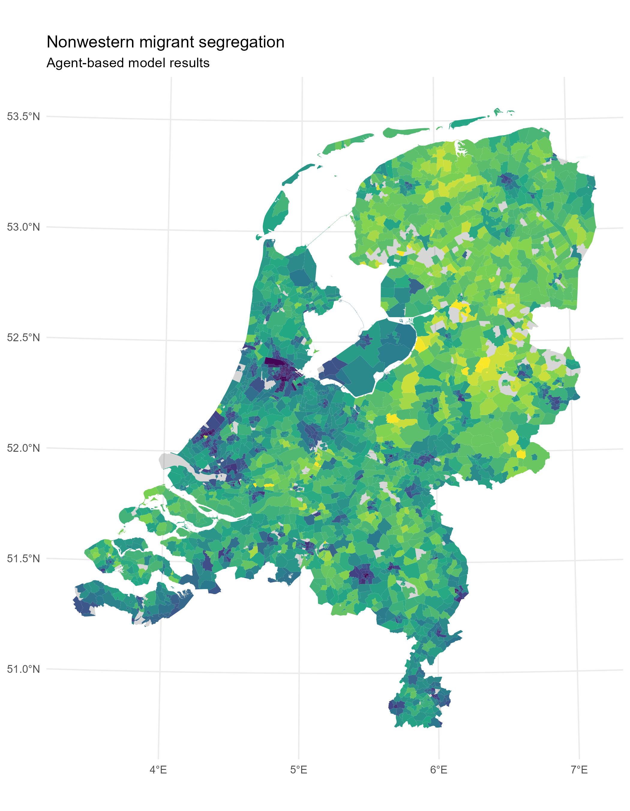

# Cluster computing with R for Social Scientists

This repository contains the code and presentation of the workshop on parallel computing & cluster computing using R in collaboration with SURF. More information & sign-up can be found on the website [here](https://www.surf.nl/en/agenda/cluster-computing-for-social-scientists-with-r).



## Prerequisites
- Some `R` knowledge & experience :)
- `R`, minimum version `4.2.0` (download [here](https://cran.r-project.org/))
- If you are on Windows: `RTools` (download [here](https://cran.r-project.org/bin/windows/Rtools/))
- Recommended IDE: `RStudio` (download [here](https://www.rstudio.com/products/rstudio/download/#download))
- Install the following packages:
  ```r
  install.packages(c("Rcpp", "tidyverse", "pbapply", "sf", "mgcv"))
  ```
- Download this repository ([link](https://github.com/sodascience/ossc_workshop/archive/refs/heads/main.zip)) and unzip it to a nice location
- Open the project by double-clicking on `ossc_workshop.Rproj` in the folder.

## Schedule

| Time  | Title                                           | Required resource                   |
| :---- | :---------------------------------------------- | :---------------------------------- |
| 09:00 | Introduction to Supercomputing and the OSSC     | [`slides`](https://surfdrive.surf.nl/files/index.php/s/3wETmOZpKoe3hhu) |
| 11:00 | Lecture: computational limits in social science | [`slides`](./slides/intro.pdf)      |
| 11:45 | Hands-on: a parallel agent-based model in R     | [`assignment`](./hands_on/intro.md) |
| 12:30 | Break                                           | `lunch`                             |
| 13:30 | Lecture: supercomputing with R                  | [`slides`](./slides/supercomp.pdf)  |
| 14:15 | Hands-on: submitting an R array job             | [`assignment`](./hands_on/super.md) |
| 15:15 | Break                                           | `coffee :)`                         |
| 15:30 | Lecture: combining & analysing the results      | [`slides`](./slides/results.pdf)    |
| 16:15 | Conclusion & Q&A                                | `your remaining attention!`         |

## End result: a map of the Netherlands
The below map would take around 6 months to produce using the naïve implementation on a normal computer. You will learn how to compute it in a few hours on a supercomputer.



## Contact

This project is developed and maintained by the [ODISSEI Social Data
Science (SoDa)](https://odissei-data.nl/nl/soda/) team.


Do you have questions, suggestions, or remarks? File an issue in the
issue tracker or feel free to contact [Erik-Jan van
Kesteren](https://github.com/vankesteren)
([@ejvankesteren](https://twitter.com/ejvankesteren))
